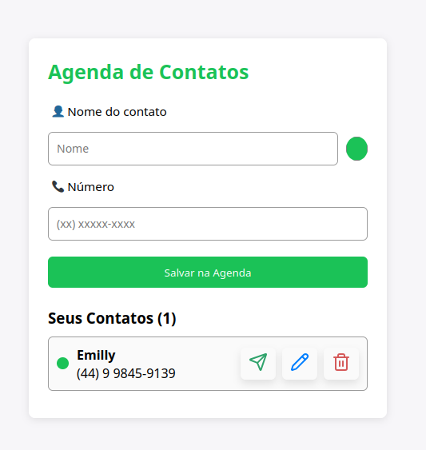

<h1 id="whatsapp-hub"> WhatsApp Hub</h1>


Este projeto, realizado pelos alunos: Emanuel Alves; Emilly Damasceno e Gustavo Naida, têm por objetivo **gerar links personalizados que redirecionam os usuários diretamente para iniciar conversas no WhatsApp, podendo salvar contatos e organizá-los**, facilitando a comunicação entre clientes e prestadores de serviço, ou qualquer pessoa que deseje compartilhar um link direto de contato.

---
# Sumário
  - [Descrição](#descrição)
  - [Link da Aplicação](#link-da-aplicação)
  - [Execução local](#execução-local)
  - [Telas](#telas)
  - [Funcionalidades](#funcionalidades)
  - [Funcionalidades Extras](#funcionalidades-extras)
  - [Tecnologias Utilizadas](#tecnologias-utilizadas)

## Descrição

O **WhatsApp Hub** é uma aplicação web simples e intuitiva que permite ao usuário criar um link direto para iniciar uma conversa no WhatsApp com qualquer número de telefone, podendo incluir uma mensagem personalizada. O mesmo também possui, juntamente ao gerador de links, a Agenda de Contatos, que possibilita salvar e organizar contatos dentro do Web Site.

A ideia é facilitar a vida de quem precisa compartilhar seu número de WhatsApp em sites, redes sociais ou plataformas de atendimento e organizar listas de contatos.

---
## Link da aplicação ---------------pedir ao gustavo

## Execução local
Como Executar o Projeto em seu computador:
```bash

# Clonar o repositório 
https://github.com/gustavonaida/TrabalhoDW-WhatsApp.git

# Entrar na pasta do projeto
cd TrabalhoDW-WhatsApp

# Instalar dependências
npm install

# Rodar no servidor local
npm run dev

# O projeto estará disponível em:
👉 http://localhost:5173

```

## Telas
Todas as telas foram estilizadas com CSS.

#### Tela principal


#### Tela ao gerar o link 


#### Tela ao clicar em "Abrir Whatsapp"
O usuário é redirecinado ao próprio WhatsApp, com requisitos que preencheu ao gerar o link.


---

## Funcionalidades

* Gerar link direto de redirecionamento para o WhatsApp  
* Adicionar mensagem personalizada (ou mensagem padrão) no link  
* Interface limpa e responsiva desenvolvida com **React + Vite**
* Integração com **Supabase** para armazenamento e gerenciamento de dados  
* Possibilidade de salvar contatos e links criados por meio do banco de dados integrado ao **Supabase**

## Funcionalidades extras
* Organização da Lista de Contatos através de cores, onde os contatos ficam salvos no banco de dados e podemos alterá-los dentro da Lista de Contatos, onde é possível organizar os contatos, agrupando-os através de cores previamente selecionadas. Essa funcionalidade foi implementada para permitir que o usuário organize seus contatos de forma visual e rápida, melhorando a usabilidade e tornando o sistema mais intuitivo.
* Opção de envio de mensagens padrão ao gerar o Lindo do WhatsApp. Essa funcionalidade foi implementada para permitir que o usuário possa otimizar o seu tempo com prompts pré estabelecidos de mensagens comuns entre os clientes.

#### Telas das funcionalidades extras
Organização de contatos por cor:
<p align="center">
  
  &nbsp;&nbsp;&nbsp;&nbsp;&nbsp;&nbsp;&nbsp;&nbsp;
  
</p>


Envio de mensagens padrão:

<p align="center">
  

---

## Tecnologias Utilizadas

| Categoria | Ferramenta |
|------------|-------------|
| **Frontend** | [React](https://react.dev/) + [Vite](https://vitejs.dev/) |
| **Banco de Dados** | [Supabase (PostgreSQL)](https://supabase.com/) |
| **Linguagem** | JavaScript |
| **Estilização** | CSS |
| **Gerenciamento de dependências** | npm |

---

