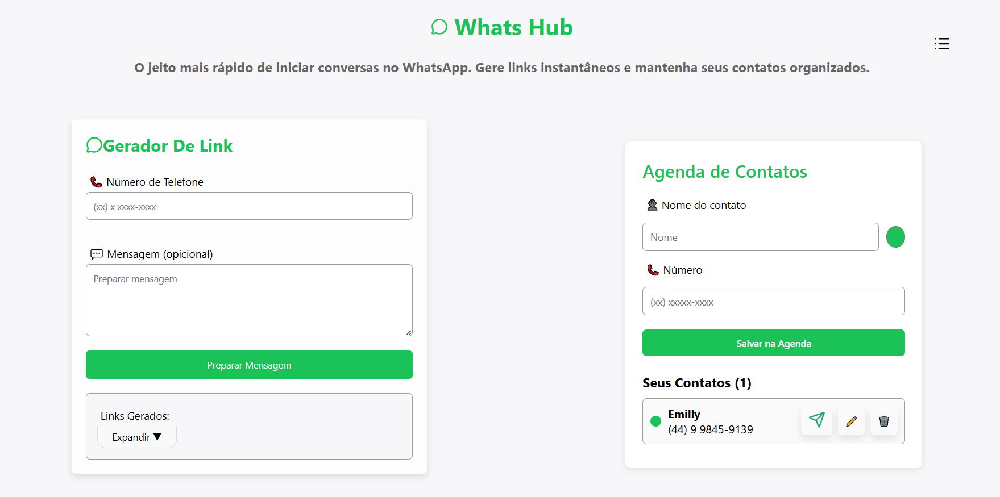

# WhatsApp Hub 

Este projeto tem como objetivo **gerar links personalizados que redirecionam diretamente para iniciar conversas no WhatsApp e salvar contatos**, facilitando a comunicação entre clientes e prestadores de serviço, lojas, ou qualquer pessoa que deseje compartilhar um link direto de contato.

---

## Sumário

- [WhatsApp Hub ](#whatsapp-hub-)
  - [Sumário](#sumário)
  - [Descrição](#descrição)
  - [Telas](#telas)
    - [Tela principal](#tela-principal)
  - [Funcionalidades](#funcionalidades)
    - [Funcionalidade extra](#funcionalidade-extra)
    - [Tela de funcionalidade](#tela-de-funcionalidade)
  - [Tecnologias Utilizadas](#tecnologias-utilizadas)
  - [| **Gerenciamento de dependências** | npm |](#-gerenciamento-de-dependências--npm-)
  - [Estrutura do Projeto](#estrutura-do-projeto)

---

##  Descrição

O **WhatsApp Hub** é uma aplicação web simples e intuitiva que permite ao usuário criar um link direto para iniciar uma conversa no WhatsApp com qualquer número de telefone, podendo incluir uma mensagem personalizada. O mesmo também possuí, juntamente ao gerador de linkos, a Agenda de Contatos. Que possibilita salvar e organizar contatos dentro do Web Site.

A ideia é facilitar a vida de quem precisa compartilhar seu número de WhatsApp em sites, redes sociais ou plataformas de atendimento e organizar listas de contatos.

---

## Telas
Todas as telas foram estilizadas com o CSS.
### Tela principal

---

## Funcionalidades

* Gerar link direto de redirecionamento para o WhatsApp  
* Adicionar mensagem personalizada (ou mensagem padrão) no link  
* Interface limpa e responsiva desenvolvida com **React + Vite**
* Integração com **Supabase** para armazenamento e gerenciamento de dados  
* Possibilidade de salvar contatos e links criados para por meio do banco de dados integrado ao **Supabase**
### Funcionalidade extra
* Organização da Lista de Contatos através de cores, onde os contatos ficam salvosno banco de dados e podemos altera-los dentro da Lista de Contatos, onde é possível organizar os contatos, agrupando-os através de cores previamente selecionadas.
  ### Tela de funcionalidade 

  
  &nbsp;&nbsp;&nbsp;&nbsp;&nbsp;&nbsp;&nbsp;&nbsp;
  

---

## Tecnologias Utilizadas

| Categoria | Ferramenta |
|------------|-------------|
| **Frontend** | [React](https://react.dev/) + [Vite](https://vitejs.dev/) |
| **Banco de Dados** | [Supabase (PostgreSQL)](https://supabase.com/) |
| **Linguagem** | JavaScript  |
| **Estilização** |  CSS  |
| **Gerenciamento de dependências** | npm |
---

## Estrutura do Projeto